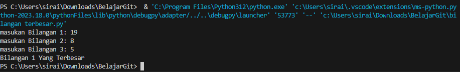
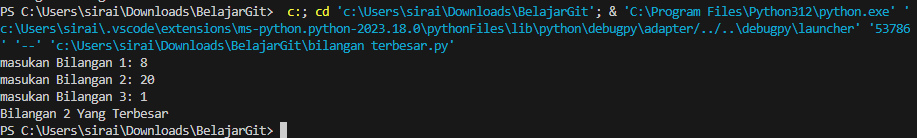
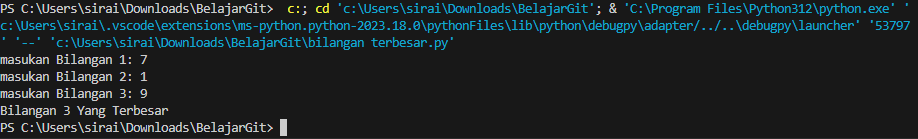
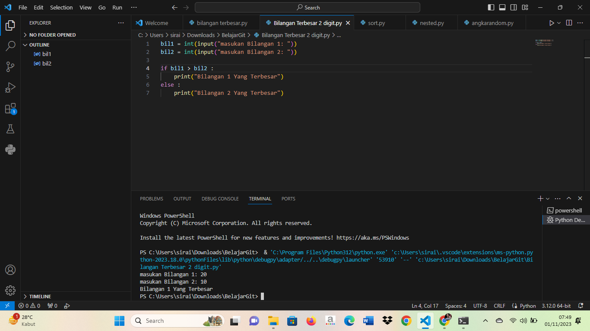
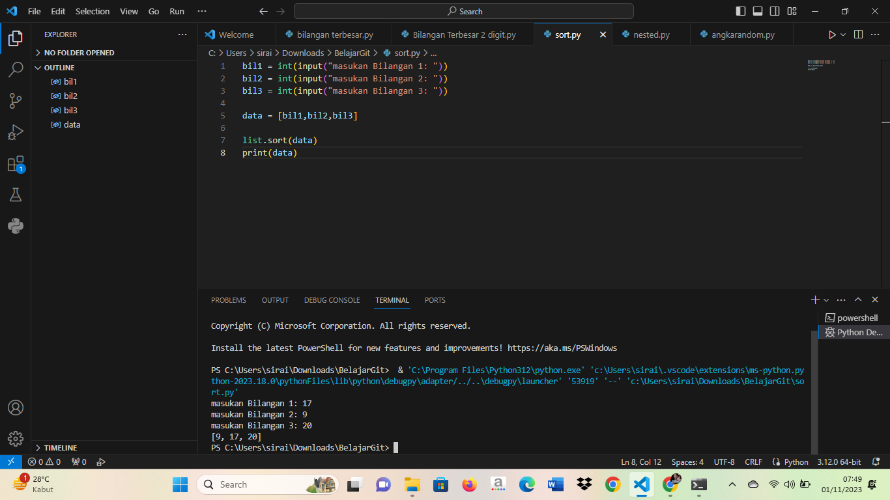
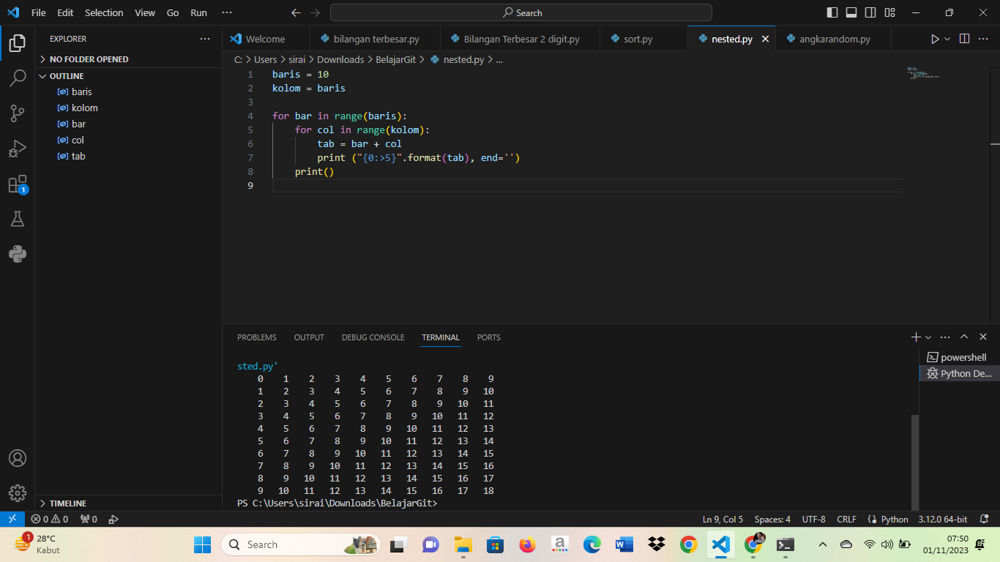
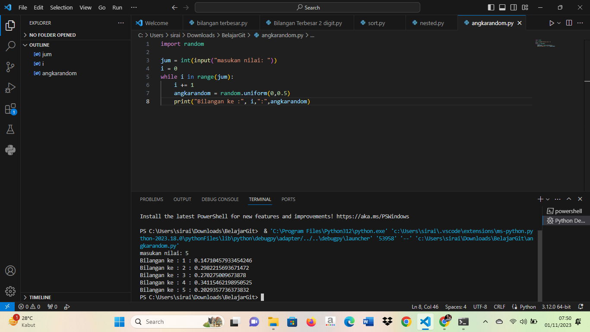

# labspy02
<h1>Bilangan Terbesar dari 3 Bilangan</h1>

<h2>Output</h2>

### Bilangan 1 Terbesar

### Bilangan 2 Terbesar

### Bilangan 3 Terbesar

## Bilangan Terbesar 2 Digit

## Urutkan Data Dari Terkecil ke Terbesar

## Perulangan Bertingkat

## Angka Random

