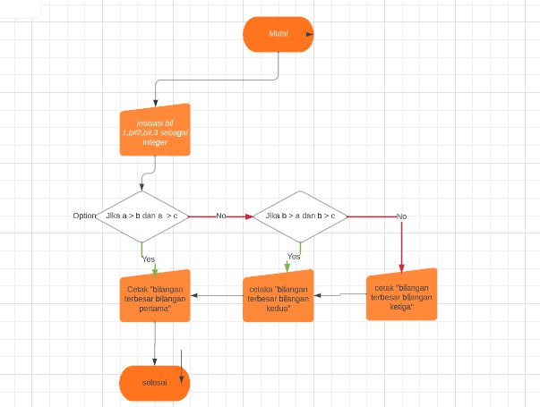

# labspy02

langkah langkah
<h1>input 3 buah bilangan</h1>

 tentukan bilangan terbesar menggunakan if dan else

<h2>Flowchart</h2>

<h2>Output</h2>

### Bilangan 1 Terbesar

### Bilangan 2 Terbesar

### Bilangan 3 Terbesar

## Bilangan Terbesar 2 Digit

## Urutkan Data Dari Terkecil ke Terbesar

## Perulangan Bertingkat

## Angka Random

